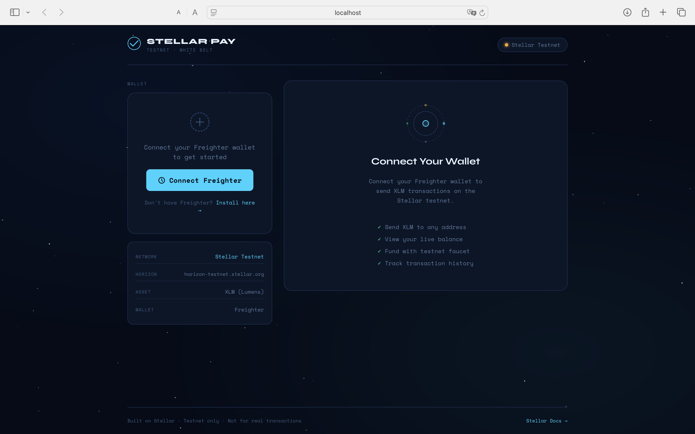
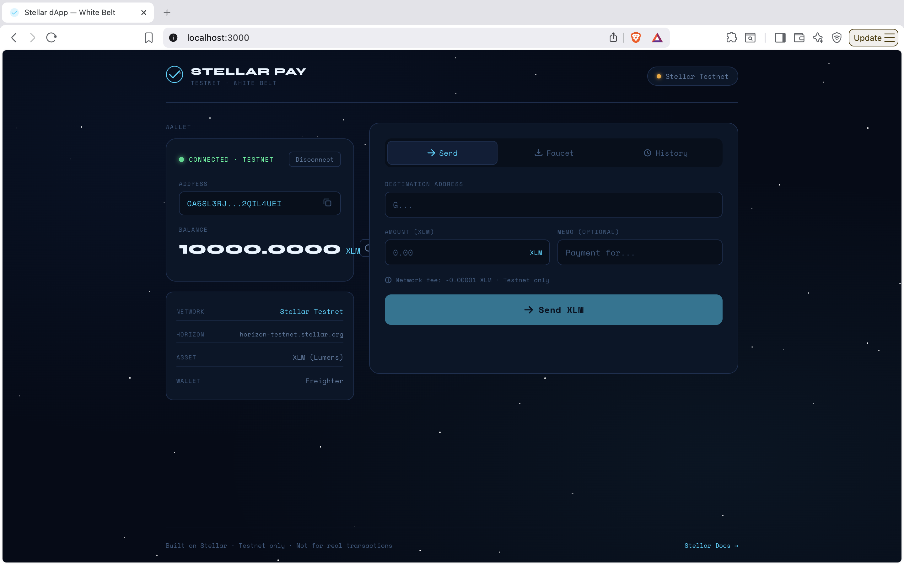
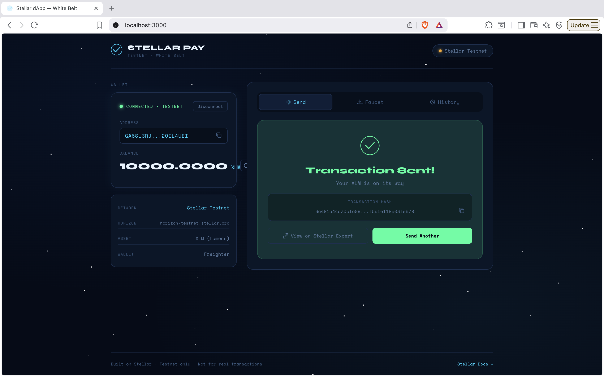

# 🌟 Stellar Pay — White Belt dApp

A clean, production-ready Stellar testnet payment dApp built for the **Level 1 – White Belt** challenge.

## ✨ Features

- 🔗 **Wallet Connection** — Connect/disconnect Freighter wallet with one click
- 💰 **Live Balance** — Real-time XLM balance with auto-refresh every 15 seconds
- 📤 **Send XLM** — Send XLM transactions on Stellar testnet with memo support
- 🚰 **Faucet** — Fund your testnet account with 10,000 XLM via Friendbot
- 📜 **Transaction History** — View your 5 most recent transactions with explorer links
- ✅ **Full Feedback** — Success/failure states, transaction hash display, Horizon links

---

## 🛠️ Tech Stack

| Technology | Purpose |
|---|---|
| Next.js 14 | React framework |
| TypeScript | Type safety |
| `@stellar/stellar-sdk` | Stellar blockchain interaction |
| `@stellar/freighter-api` | Wallet connection |
| CSS Modules (styled-jsx) | Component styling |

---

## 🚀 Setup Instructions

### Prerequisites

1. **Node.js** v18 or higher
2. **Freighter Wallet** — Install the browser extension from [freighter.app](https://freighter.app)
3. Set Freighter to **Testnet** in its settings

### Installation

```bash
# Clone the repository
git clone https://github.com/YOUR_USERNAME/stellar-white-belt-dapp.git
cd stellar-white-belt-dapp

# Install dependencies
npm install

# Run development server
npm run dev
```

Open [http://localhost:3000](http://localhost:3000) in your browser.

### Build for Production

```bash
npm run build
npm start
```

---

## 🎮 How to Use

1. **Install Freighter** — Download from [freighter.app](https://freighter.app)
2. **Switch to Testnet** — In Freighter settings, select "Testnet"
3. **Connect Wallet** — Click "Connect Freighter" on the app
4. **Fund Account** — Go to the "Faucet" tab and click "Fund from Friendbot" to get 10,000 test XLM
5. **Send XLM** — Enter a destination address and amount in the "Send" tab
6. **View History** — Check recent transactions in the "History" tab

---

## 📸 Screenshots

### Landing Page


### Wallet Connected & Balance Displayed


### Successful Transaction


---

## 🏗️ Project Structure

```
src/
├── components/
│   ├── WalletPanel.tsx      # Wallet connect/disconnect UI
│   ├── SendPayment.tsx      # XLM send form + success state
│   ├── FaucetFund.tsx       # Friendbot faucet component
│   └── RecentTransactions.tsx # Transaction history list
├── hooks/
│   ├── useWallet.ts         # Wallet state management
│   └── useTransaction.ts    # Transaction send logic
├── lib/
│   └── stellar.ts           # Stellar SDK utilities
├── pages/
│   ├── _app.tsx             # Next.js app wrapper
│   └── index.tsx            # Main page layout
└── styles/
    └── globals.css          # Global styles + CSS variables
```

---

## 🔧 Key Implementation Details

### Wallet Integration
Uses `@stellar/freighter-api` to connect to the Freighter browser extension. The app checks if Freighter is installed and retrieves the user's public key.

### Balance Fetching
Queries Stellar Horizon testnet API (`horizon-testnet.stellar.org`) to load account details and extract the native XLM balance. Refreshes every 15 seconds automatically.

### Transaction Flow
1. User enters destination address + amount
2. App builds a `TransactionBuilder` transaction with `Operation.payment`
3. Transaction is signed via `signTransaction()` from Freighter API
4. Signed XDR is submitted to Horizon via `server.submitTransaction()`
5. Success state shows the transaction hash with a link to Stellar Expert explorer

### Error Handling
- Invalid Stellar addresses caught before submission
- Network errors displayed with user-friendly messages
- Account not found / unfunded states handled gracefully

---

---

## 📝 Submission

This project satisfies all White Belt Level 1 requirements:

- ✅ Freighter wallet setup and connection
- ✅ Wallet connect / disconnect functionality  
- ✅ XLM balance fetch and display
- ✅ XLM transaction on Stellar testnet
- ✅ Success/failure feedback with transaction hash
- ✅ Public GitHub repository
- ✅ README with setup instructions and screenshots

---

Built with ❤️ on the Stellar network
